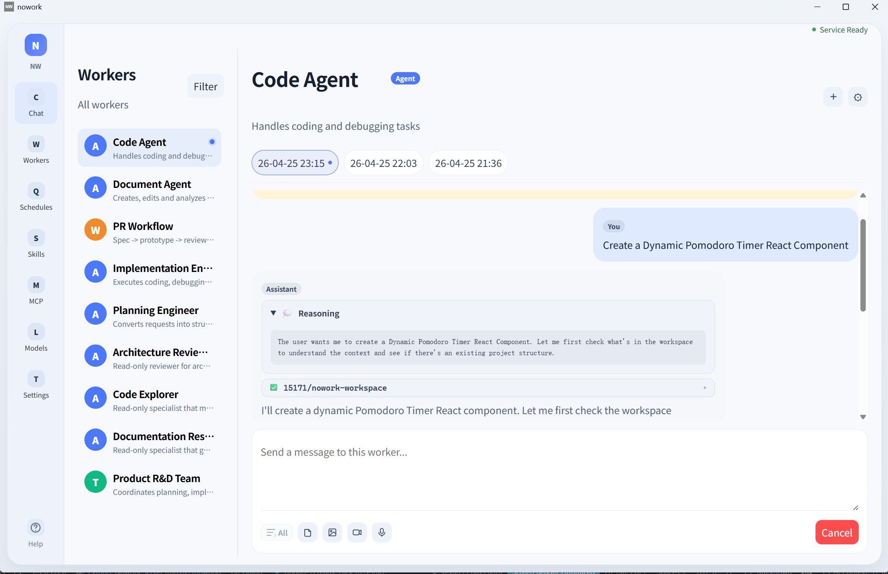
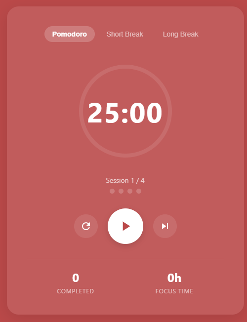
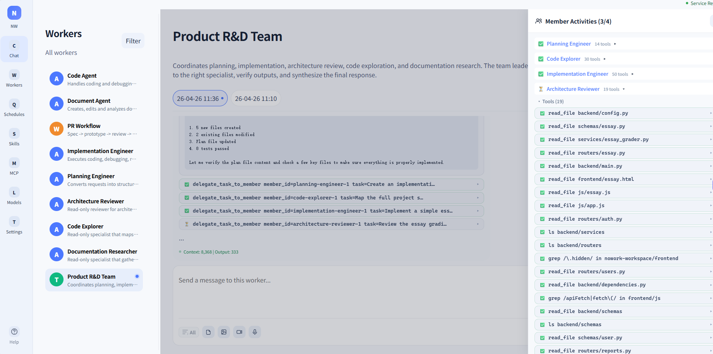
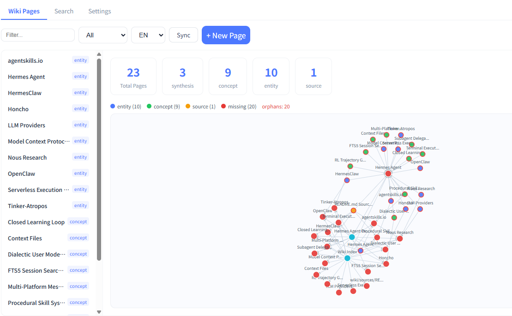

<div align="center">

# NoWork

**Agents do the work. You don't have to.**

A desktop AI agent workspace where each Agent or Team appears like a chat contact.
Pick a worker, start a conversation, and let it plan, code, review, research, or process documents for you.

Build your own AI workforce — all in one chat window.

[简体中文](./README.zh-CN.md)

</div>

---

## 📸 Screenshots

#### 🖥️ Main Interface

<p align="center">
  
</p>

<p align="center"><em>A clean, contact-style workspace for managing multiple agent conversations.</em></p>

#### 🚀 Example: Building a Pomodoro Timer

<p align="center">
  
</p>

<p align="center"><em>A coding agent plans and builds a simple Pomodoro timer from scratch.</em></p>

#### 👥 Team Worker: Multi-Agent Collaboration

<p align="center">
  
</p>

<p align="center"><em>Team workers coordinate multiple agents — watch member activities, tool calls, and progress in real time.</em></p>

#### 📚 Knowledge Base: Wiki-Driven Knowledge Management

<p align="center">
  
</p>

<p align="center"><em>Build a structured Wiki from your documents — auto-ingest files, browse pages, search, and visualize knowledge graphs.</em></p>

---

## What is NoWork?

NoWork is a **desktop-first multi-agent app** built for practical work:

- **Coding** — planning, implementation, review, debugging
- **Document work** — Word, Excel, PowerPoint, PDF
- **Research** — web browsing, summarization, technical exploration
- **Ongoing workflows** — long conversations, scheduled runs, reusable workers

Instead of juggling prompts, terminals, and scripts, you talk to workers as if they were contacts in a chat app.

---

## 🤔 Why NoWork?

Command-line AI tools are powerful, but they still create friction for many users. Existing desktop wrappers often feel unstable, too thin, or too dependent on manual environment setup.

NoWork takes a different approach:

- **Desktop-first, not terminal-first** — install and run without needing CLI workflows
- **Chat-native interaction** — every agent or team is a contact, so delegation feels natural
- **Bundled runtime** — the app ships with its own backend and embedded Python runtime
- **Local workspace access** — agents can work with real files inside configured directories
- **Small-team and solo-friendly** — practical multi-agent automation without platform complexity

The goal is simple: let AI handle repetitive work, so you can stay focused on decisions and results.

---

## ✨ Key Capabilities

| Capability | Description |
|---|---|
| **Contact-style workers** | Each Agent / Team appears as a chat contact. Click and start working. |
| **Multi-agent collaboration** | Built-in planning, coding, review, architecture, research, and document workers. |
| **50+ model providers** | Powered by [Agno](https://github.com/agno-agi/agno). Supports OpenAI, Anthropic, Google, DeepSeek, Qwen, Ollama, vLLM, and many more. |
| **Long-session continuity** | Automatic context compaction helps preserve useful state in long conversations. |
| **Workspace-safe file access** | Sandboxed file and shell operations limited to configured directories and permissions. |
| **Document processing skills** | Built-in support for Word, Excel, PowerPoint, and PDF workflows. |
| **Knowledge bases** | Wiki-driven knowledge management with auto-ingest, full-text search, knowledge graphs, and Worker integration. Supports both Wiki mode and traditional vector mode. |
| **Scheduled runs** | Set recurring tasks for workers to run automatically. |
| **MCP integration** | Connect external tools through Model Context Protocol. |
| **Desktop-native packaging** | Tauri desktop shell with bundled backend and embedded Python runtime. |
| **Bilingual UI** | English / 简体中文 support with instant switching. |

---

## 🚀 Quick Start

### For end users

1. **Download** the latest release from the [Releases page](https://github.com/yeyan00/nowork/releases)
2. **Install** the desktop app
3. **Configure a model provider**
4. **Choose a worker**
5. **Start chatting and delegating work**

### Minimal model configuration

Create a provider file such as:

```yaml
# server/config/models/my-provider.yaml
provider_id: my-provider
name: My Provider
base_url: https://api.openai.com/v1
api_key: sk-xxx
models:
  - id: gpt-4o
    name: GPT-4o
    image: true
    video: false
```

Then set the default model:

```yaml
# server/config/config.yaml
default_model: my-provider/gpt-4o
```

After that, open the app, pick a worker, and start chatting.

---

## 🧠 Built-in Workers

NoWork ships with a practical default workforce for common engineering and document tasks.

| Worker | Role | Type |
|---|---|---|
| Code Agent | Write, edit, and debug code | Agent |
| Planning Engineer | Analyze requirements and write implementation plans | Agent |
| Implementation Engineer | Execute plans step by step | Agent |
| Architecture Reviewer | Read-only review and risk analysis | Agent |
| Code Explorer | Search, navigate, and understand codebases | Agent |
| Documentation Researcher | Write docs and research technical topics | Agent |
| Doc Agent | Process Office/PDF documents and perform web research | Agent |
| Product R&D Team | Planner → coder → reviewer pipeline | Team |

> Workers are YAML-driven — add, remove, or customize them without changing application code.

---

## ⚙️ Configuration

| File | Purpose |
|---|---|
| `server/config/config.yaml` | Global config: default model, tools, server settings |
| `server/config/models/*.yaml` | Model provider definitions, API keys, endpoints, capabilities |
| `server/config/workers/*.yaml` | Worker definitions: instructions, tools, workspaces, history, learning |
| `server/config/knowledge/*.yaml` | Knowledge base definitions: paths, wiki mode, purpose, auto sync |
| `server/config/mcp.yaml` | MCP server connections |

### Example worker config

```yaml
# server/config/workers/my-worker.yaml
agent:
  id: my-worker
  name: My Worker
  instructions: You are a helpful coding assistant.
tools:
  - module: app.tools.codingTools
    class: CodingTools
    config:
      base_dirs:
        - C:/Users/me/projects
workspaces:
  - path: C:/Users/me/projects
    permission: read-write
```

---

## 🏗️ Architecture

NoWork uses a Tauri desktop shell, a React frontend, and a local FastAPI + Agno backend with an embedded Python runtime.

```text
┌─ Tauri Desktop (Rust) ─────────────────────────────┐
│                                                    │
│  ┌─ React Frontend (Vite + TypeScript) ──────────┐ │
│  │  NavRail │ Worker List │ Chat Workspace       │ │
│  │  Voice   │ Schedules   │ Settings │ Help      │ │
│  └───────────────────────────────────────────────┘ │
│                      HTTP / SSE                    │
│  ┌─ Python Backend (FastAPI) ───────────────────┐ │
│  │  Agno AgentOS ─ Agent / Team / Workflow      │ │
│  │  CodingTools (sandboxed shell + file ops)    │ │
│  │  CompactionManager (context management)      │ │
│  │  MCP Client │ Knowledge Base │ Skills        │ │
│  │  Session Persistence (SQLite)                │ │
│  └──────────────────────────────────────────────┘ │
│  Tauri manages backend lifecycle automatically    │
└────────────────────────────────────────────────────┘
```

---

## 🛠️ Run in Development

### Prerequisites

| Tool | Version |
|---|---|
| Node.js | >= 18 |
| Python | >= 3.10 |
| Rust | stable |

### Setup

```powershell
# Python deps
pip install -r requirements.txt

# Frontend deps
cd web
npm install
cd ..
```

### Start development environment

```powershell
powershell -ExecutionPolicy Bypass -File scripts/start-dev.ps1
```

### Useful commands

```powershell
# Frontend only
cd web
npm run dev

# Backend only
conda activate nowork
$env:PYTHONPATH = "server"
python -m app.run

# Full desktop app
npm run tauri:dev
```

---

## 📦 Build Release

```powershell
# Recommended
powershell -ExecutionPolicy Bypass -File scripts/build-release.ps1
```

Output:

```text
src-tauri/target/release/bundle/
```

### Packaging notes

- Release builds bundle an **embedded Python runtime**
- Python dependencies are copied using a **filtered allowlist**, not a full Conda environment
- End users do **not** need Python, Conda, or manual dependency installation
- Server code and resources are packaged into the desktop app directly

---

## 📄 License

[MIT License](LICENSE)
